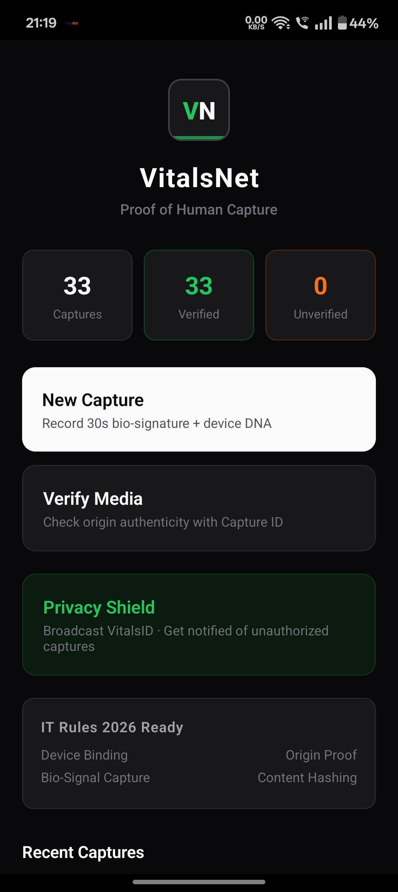
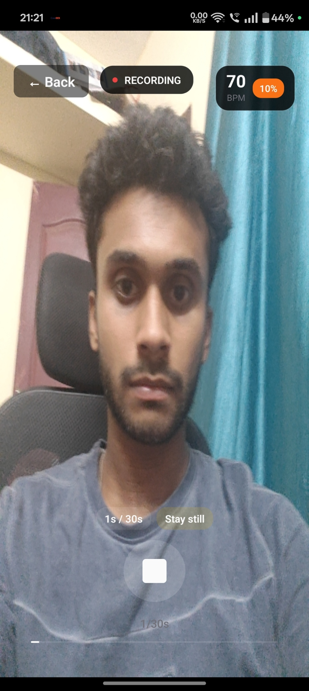
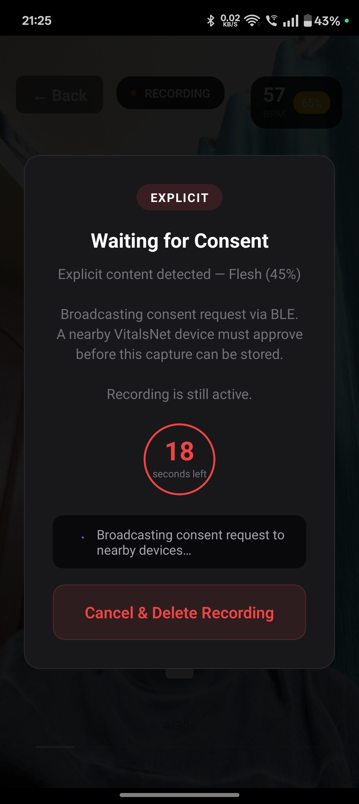
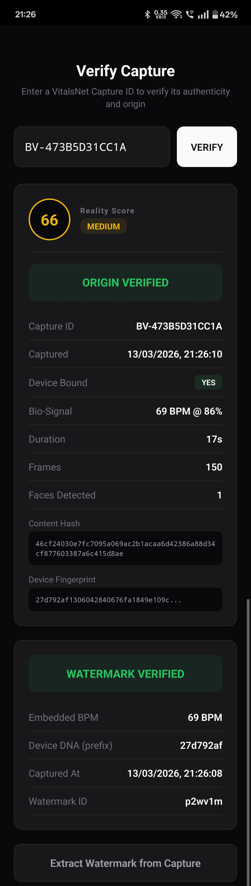
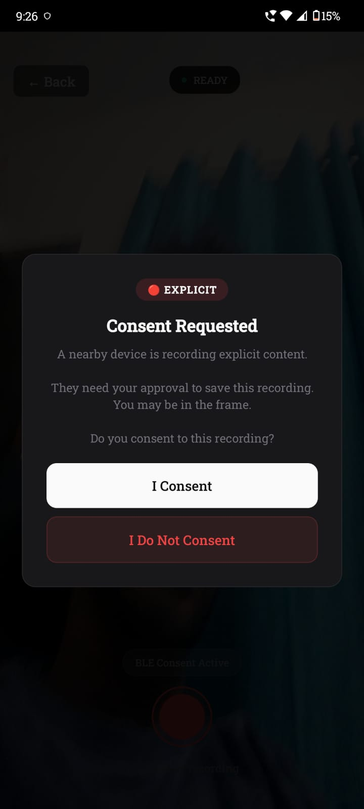

# VitalsNet

Proof of Human Capture.

VitalsNet is an Android-first React Native app that combines capture-time authenticity, bio-signal extraction, watermark verification, BLE consent, and Privacy Shield alerts in one minimal workflow.

## Product highlights

- Capture with device-bound authenticity signals
- rPPG/TS-CAN heartbeat and liveness signal path
- Watermark embed and extract verification path
- Reality Score with transparent component breakdown
- BLE consent handshake for sensitive content
- Privacy Shield for nearby unconsented capture detection
- Firestore REST sync for captures and privacy alerts

## Demo UI (actual app screens)

### Home dashboard


### Live camera recording


### Consent wait overlay (capture side)


### Verify capture and watermark evidence


### Consent request overlay (nearby device side)


## End-to-end flow

1. User records media in VitalsNet camera.
2. Native pipeline computes bio/device/authenticity signals.
3. If content is sensitive, BLE consent is requested and validated.
4. Capture metadata and proof are persisted and can be verified by Capture ID.
5. Privacy Shield can broadcast VitalsID and receive violation alerts.

## Architecture (high level)

- React Native app and screens: user flow, capture UX, verification UX
- Android native bridge: camera + BLE + service operations (`BioVaultModule`)
- Native SDK (`biovault-sdk`): scoring, inference, consent broadcaster
- C++ modules: performance-critical signal/crypto path
- Firebase REST service layer: captures + privacy alerts

## Repository structure

```text
BioVault-main/
  mobile-app/
    src/
      screens/
      components/
      services/
    android/
      app/src/main/java/com/biovault/
      biovault-sdk/src/main/java/com/biovault/sdk/
      biovault-sdk/src/main/cpp/
    cpp/
  docs/images/
```

## Quick start

### Prerequisites
- Node.js >= 18
- npm >= 9
- Android Studio with SDK/NDK
- ADB-enabled device or emulator

### Install dependencies

```bash
npm install
npm run install:mobile
```

### Build native modules

```bash
npm run build:cpp
```

### Run Android app

```bash
npm run mobile:android
```

## Notes

- Android-first implementation
- Firebase integration uses REST APIs
- BLE + foreground service permissions are required for Privacy Shield features

## License

MIT

